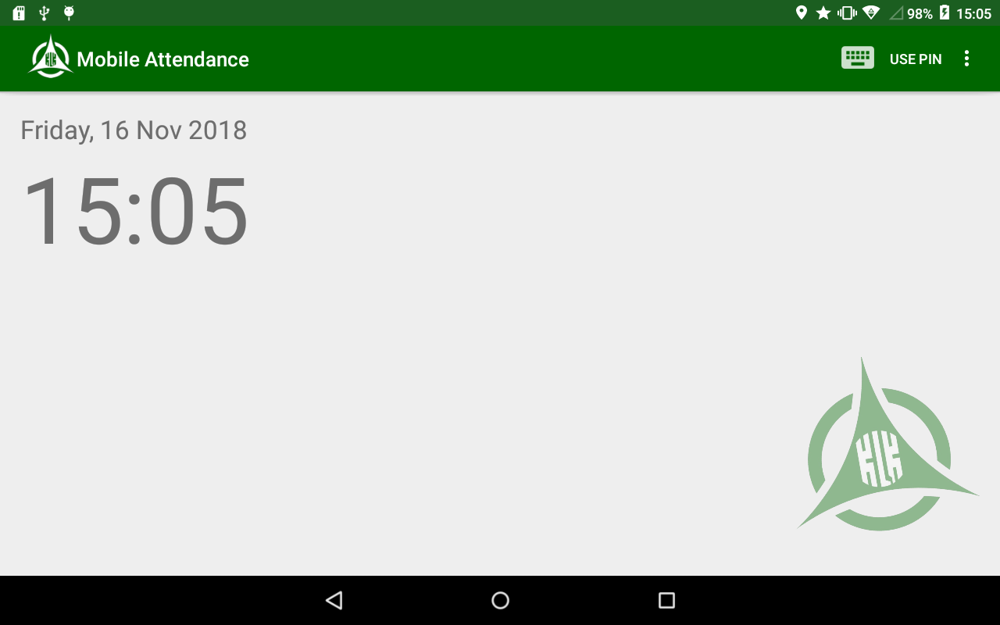
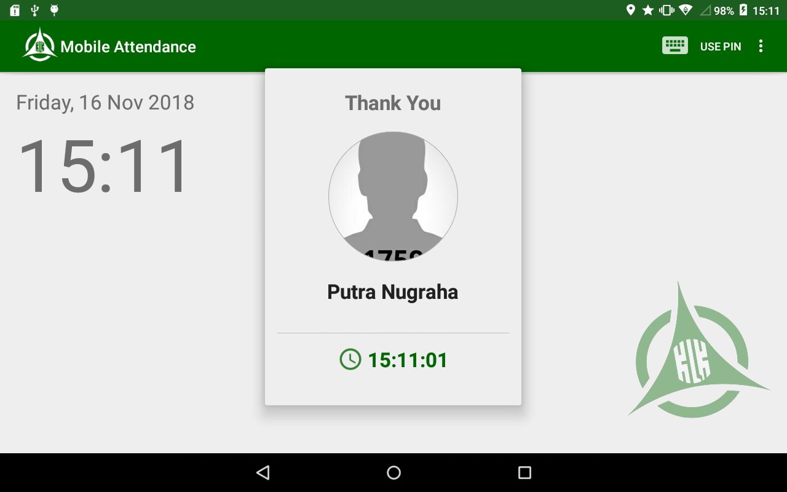

# Mobile Fingerprint
An Android Application built to capture Fingerprint to record Attendance data of Employee. This repository have yet fully merged with the original project repository due to confidential project limited to the company I work at. Please kindly contact me thru my email at **putra.graha.7@gmail.com** if you feel interested to discuss about a project similar to this project
 
## Features & Notes
- Capture fingerprint data to record attendance of employee
- Location capture on record attendance
- Enroll employee fingerprints 
- Store fingerprint and attendance data to local database (SQLite) and server
- Custom Sync Adapter to automatically send data to server if any changes occured in local database and network available
- FCM library to get Firebase service to notify if any changes occured in server
- Volley library to handle HTTP Request
- Show employees list using _Recycler View_ and _Card View_
- Smooth load animation and caching image using [Glide](https://github.com/bumptech/glide)
- Image shown in circle view using [Circle Image View](https://github.com/hdodenhof/CircleImageView)
- Simple device permission request using [Dexter](https://github.com/Karumi/Dexter)

## Project Specification
- Huifan device (Fingerprint programmable device)
- Works with company application as server to handle HTTP request (send attendance and get employee data)

## Tech Stack
- Java Language
- Android SDK Version : 28
- Huifan Fingerprint SDK
- Location listener library. Implement following code to app build.gradle
```
implementation 'com.google.android.gms:play-services-location:16.0.0'
```
- FCM library
```
implementation 'com.google.firebase:firebase-messaging:17.3.4'
```
- Volley library
```
implementation 'com.android.volley:volley:1.1.1'
```
- Android UI View : Card View, RecyclerView
```
implementation 'com.android.support:recyclerview-v7:26.0.0-alpha1'
implementation 'com.android.support:cardview-v7:26.0.0-alpha1'
```
- Glide
```
implementation 'com.github.bumptech.glide:glide:3.7.0'
```
- Circle Image View
```
implementation 'de.hdodenhof:circleimageview:2.2.0'
```
- Dexter
```
implementation 'com.karumi:dexter:5.0.0'
```
- Jebrains Annotation to give more readable code
```
implementation 'org.jetbrains:annotations-java5:15.0'
```

## Application Screenshot


